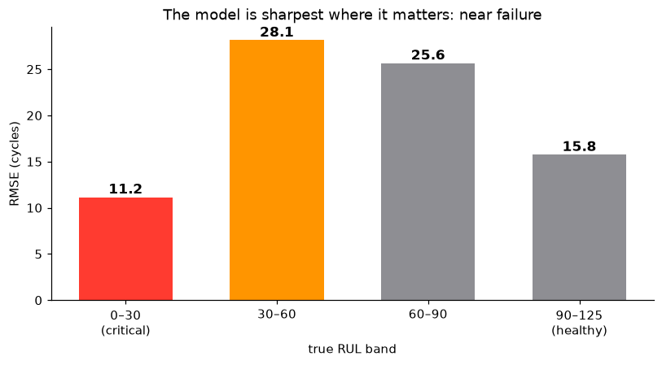
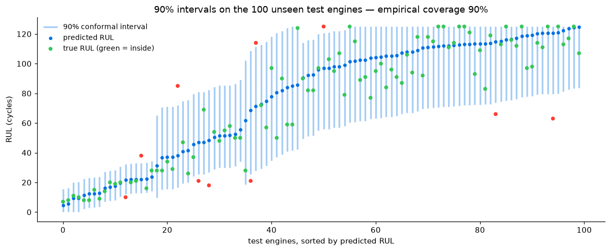
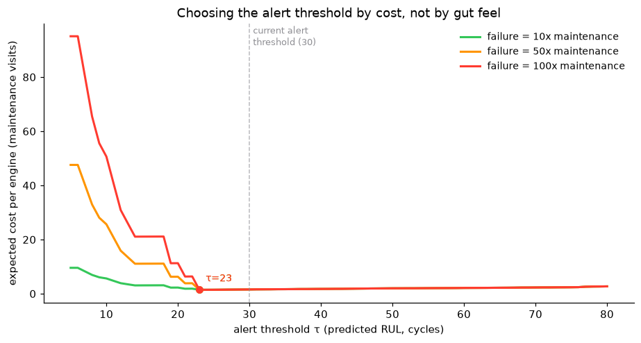
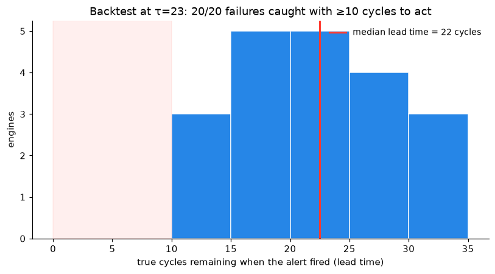
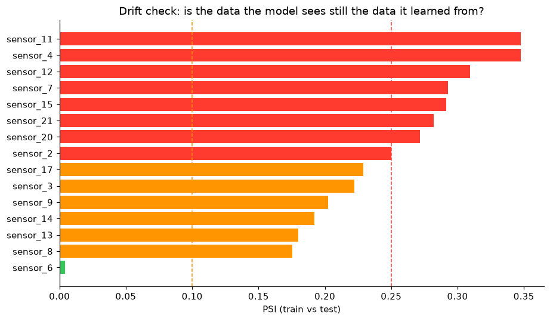

# Beyond RMSE — the analyses that make the model decision-grade

A validation RMSE of ~19 cycles says the model is *roughly right on average*. It doesn't
answer any of the questions a maintenance planner would actually ask:

1. **Where** is the model accurate — near failure, or only when nothing is wrong?
2. **How wrong** could a given prediction be? A point estimate can't schedule a shop visit.
3. **What alert threshold** minimizes cost, given that an in-flight failure costs far more
   than a scheduled service?
4. If we had run this policy on the fleet, **would it have worked?**
5. Would we **notice** if incoming data stopped looking like the training data?

Everything below is produced by one script — `python src/insights.py` — from the same
artifacts the pipeline already writes. Numbers land in `docs/insights_metrics.json`,
figures in `docs/img/`.

---

## 1. The model is sharpest exactly where it matters

One global RMSE hides a very uneven error profile. Split validation error by how close
the engine actually is to failure:

| true RUL band | RMSE (cycles) |
|---|---|
| 0–30 (critical) | **11.2** |
| 30–60 | 28.1 |
| 60–90 | 25.7 |
| 90–125 (healthy) | 15.8 |

**Why this shape:** healthy engines are easy (the clipped label is a constant 125, and
"nothing is degrading yet" is easy to recognize), and near-failure engines are easy
(degradation signatures are loud). The hard zone is **mid-life** — degradation has
started but its future speed is genuinely ambiguous from a 5-cycle window. That's not a
bug; it's the physics of the problem, and it's why the prediction intervals below are
wide in the middle and tight at the end.

The operational punchline: **error in the critical band is ~11 cycles** — small enough
to act on, and the only band where an error actually costs money.

## 2. Uncertainty you can act on — conformal prediction intervals

A planner can't schedule a shop visit off "40 cycles left"; they need "somewhere between
27 and 63, and we're 90% sure." I used **split conformal prediction** to get there:

- Take engines the model never trained on (the 20 validation engines).
- Measure the residual (true − predicted) on every cycle.
- The middle 90% of those residuals is how far off the model typically is; attach that
  band to every future prediction.

It's distribution-free — no Gaussian assumptions, works on top of any model. One twist:
RUL error is strongly **heteroscedastic** (see §1), so a single global band would be
uselessly wide near failure. I calibrate **per band of predicted RUL** (a "Mondrian"
split):

| predicted RUL | 90% band | calibration rows |
|---|---|---|
| 0–30 | −9 / +11 | 567 |
| 30–60 | −22 / +34 | 518 |
| 60–90 | −43 / +40 | 547 |
| 90+ | −41 / +24 | 2,861 |

The claim "90% of intervals contain the truth" is **verified, not assumed**: on the 100
test engines (never seen in training *or* calibration), empirical coverage is exactly
**90/100**. Mean interval width is **20 cycles** in the critical zone vs **55** in the
healthy zone — tight where decisions happen, honest where they don't.

These intervals ship in `predictions.json` (`rul_low`, `rul_high`) and render in the
dashboard — the lighter band on each engine's progress bar, and the "Likely range" in
the detail sheet.

**Asymmetric scoring.** RMSE punishes early and late predictions equally, but the domain
doesn't: predicting *more* life than an engine has (it fails in service) is far worse
than predicting less (you service early). NASA's official **PHM08 score** encodes that
asymmetry with an exponential penalty on over-prediction. This model scores **928 total
(9.3/engine)** on the test set. For context, published deep-learning models (LSTMs,
transformers) reach ~2.5–4/engine on FD001 — that gap is the price of choosing a simple,
interpretable ensemble over a sequence model, and I'd cite it as the first thing to try
if the score mattered more than explainability.

## 3. Choosing the alert threshold with a cost model, not a gut feel

The dashboard alerts at RUL < 30. Is 30 right? I built a cost model to check. Units:
one scheduled maintenance visit = 1.

- An unscheduled in-service failure costs **10–100×** a scheduled visit (swept, since
  the true ratio is fleet-specific).
- Every cycle of life thrown away by pulling an engine early costs **0.02** — wasting a
  50-cycle margin ≈ paying for one extra shop visit over the engine's life.

**My first version of this model produced garbage, and the failure is instructive.** It
recommended alerting at τ=5 — five cycles before failure — because the model rarely
misses entirely, so "alert at the last second" wastes the least life. But the median
lead time at τ=5 was **4 cycles, minimum 0**: alerts you cannot act on. The missing
ingredient was **logistics**: it takes time to route an aircraft to a maintenance base
and reserve a shop slot. I added the constraint that an alert with **< 10 cycles of
lead time counts as a failure** — you knew, but you couldn't do anything about it.
Cost models for maintenance are as much about operations as about the model.

With that constraint, the sweep gives a clean answer:

- **Optimal threshold: τ = 23**, and it's stable across all three failure-cost ratios —
  because at 23 the policy catches everything, and below it the model's own noise
  (±10 cycles near failure, §2) starts turning alerts into too-late alerts.
- The cost cliff is entirely on the left. **Alerting too late is catastrophic; alerting
  too early is merely wasteful.** Given that asymmetry, the production threshold of
  **30** = the optimum plus a safety margin of one interval half-width. The sweep
  *validates* the existing threshold rather than overturning it — which is itself the
  finding.

## 4. Backtest: replaying the policy over 20 full engine lives

RMSE is a statistician's number. The operational question is: *if the fleet had run
this alert policy, what would have happened?* I replayed every held-out engine's full
life, cycle by cycle, firing the alert the first time predicted RUL ≤ τ:

- **20/20 failures caught** with at least 10 cycles to act — zero missed, zero too-late.
- **Median lead time: 22 cycles** (min 10, max 34) — enough to schedule, not so much
  that we're throwing engines away.

**Honest caveat:** C-MAPSS is run-to-failure data — every engine fails, so a
false-alarm rate is unmeasurable (there are no healthy engines to falsely accuse).
Wasted life is the correct proxy for over-alerting here, and I'd flag that limitation
before anyone quotes the 20/20.

## 5. Drift monitoring — and why its first alarm is a lesson, not a bug

Models rot silently: the world changes, inputs shift, predictions stay confident and
become wrong. The standard first-line check is the **Population Stability Index** —
compare the distribution each sensor had in training against what the model sees now
(rule of thumb: < 0.10 stable, 0.10–0.25 investigate, > 0.25 significant shift).

Running train-vs-test PSI flags three sensors above 0.25 (sensor_11 = 0.35,
sensor_4 = 0.35, sensor_12 = 0.31) — the *same sensors the model relies on most*.
Alarming? No — and knowing why is the point. Training engines run **to failure**;
test engines are **truncated mid-life**. The test population simply contains fewer
late-stage-degradation readings, so the degradation-sensitive sensors shift by
construction. The monitor is correctly detecting a **population-state shift**, not
sensor malfunction or pipeline breakage.

The lesson I'd state in an interview: **a drift alarm is a prompt for diagnosis, not a
pager for retraining.** If you auto-retrained on this signal you'd do useless work; if
you ignored PSI entirely you'd miss real sensor drift. The monitoring harness is cheap
(~30 lines); the interpretation is the skill.

---

## The one-paragraph version

> The model's error is ~11 cycles in the band where decisions happen. Every prediction
> ships with a 90% conformal interval whose coverage is verified on unseen engines —
> exactly 90/100. A cost model with a logistics constraint puts the optimal alert
> threshold at 23 cycles; the production threshold of 30 is that optimum plus a safety
> margin, and a full backtest at that policy catches 20/20 failures with a median 22
> cycles of warning. PSI drift monitoring is wired in, and its one alarm is explainable
> as population shift rather than data corruption.
