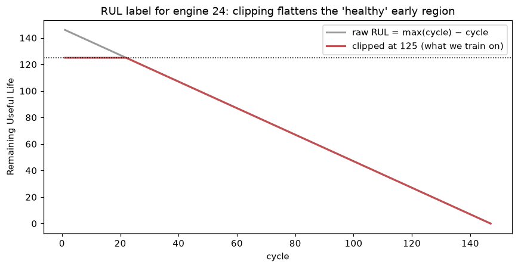
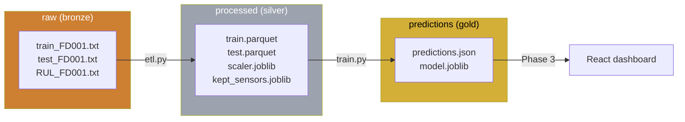
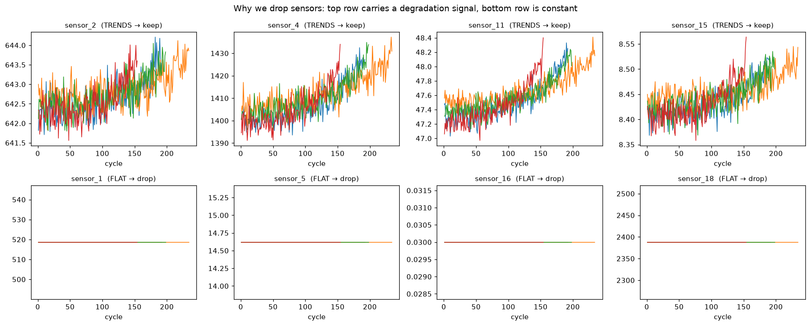
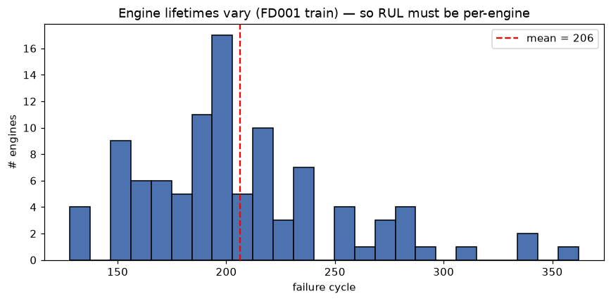
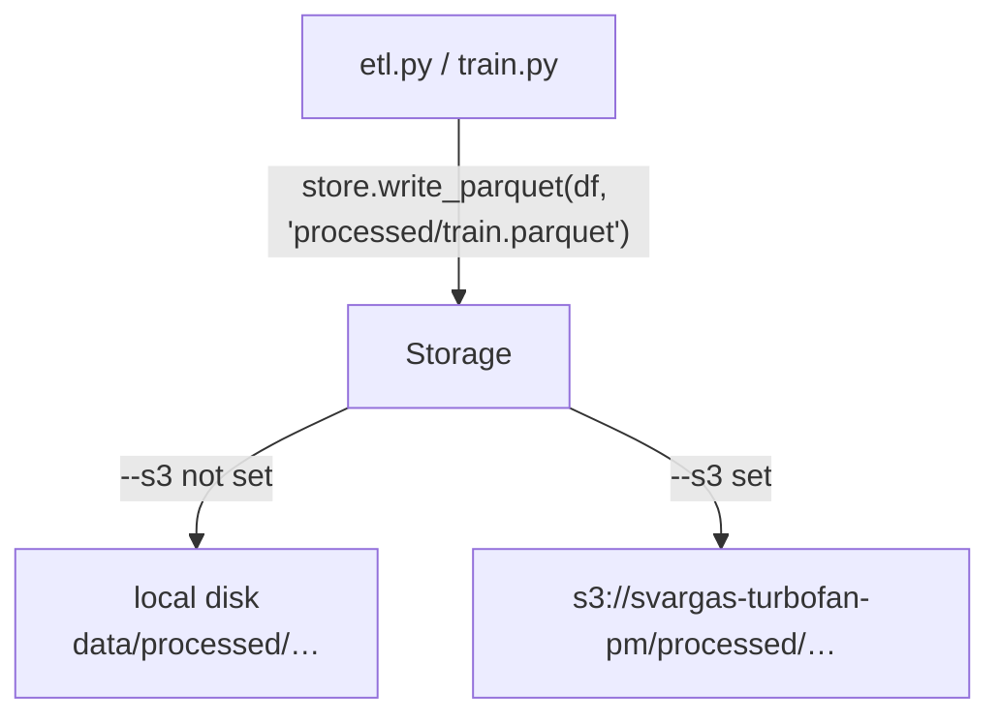
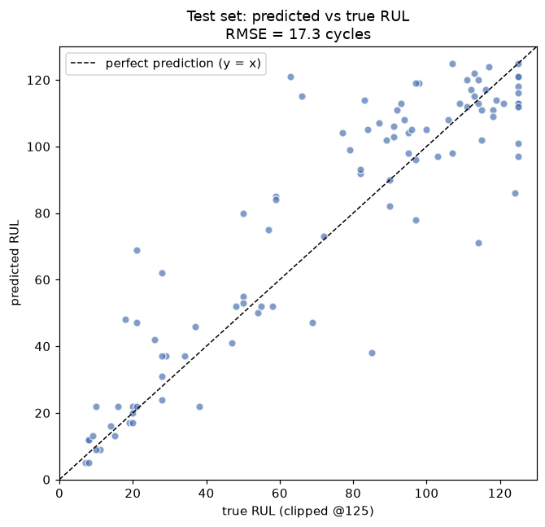
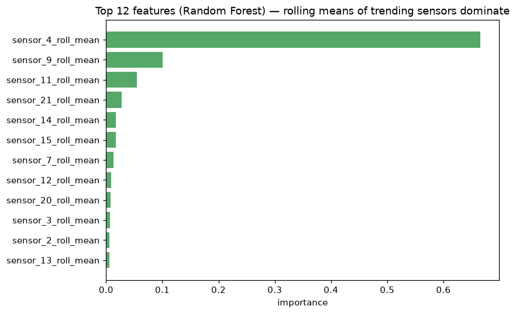
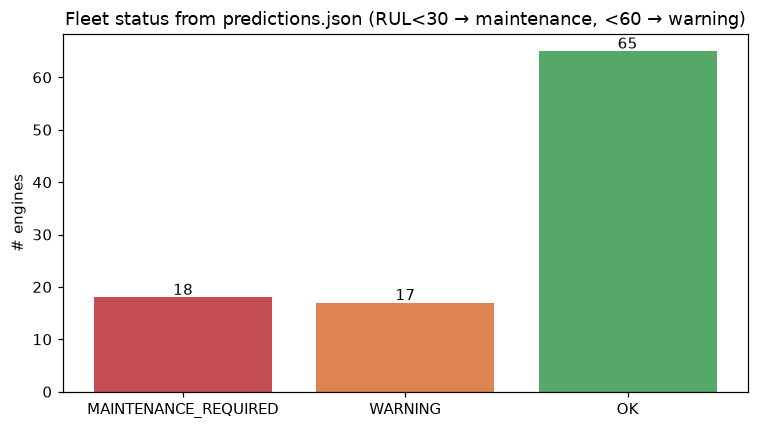
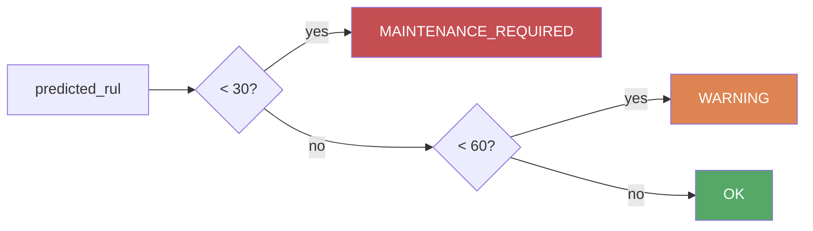

# Understanding ConditionMon — A Walkthrough for a New Developer

> **Who this is for:** a developer early in their career — you've done some uni
> projects, written Python, maybe touched a bit of machine learning, but you've
> never shipped a data pipeline end-to-end. By the end of this document you should
> understand *what* this project does, *why* every piece exists, and be able to
> change it confidently. No prior knowledge of jet engines or AWS assumed.
>
> Read it top to bottom the first time. After that it doubles as a reference.

---

## Table of contents

1. [The problem, in plain English](#1-the-problem-in-plain-english)
2. [The dataset](#2-the-dataset)
3. [Concepts you need first](#3-concepts-you-need-first)
4. [The big picture (architecture)](#4-the-big-picture-architecture)
5. [The pipeline, file by file](#5-the-pipeline-file-by-file)
6. [The output: predictions.json](#6-the-output-predictionsjson)
7. [Running it in the cloud (AWS S3)](#7-running-it-in-the-cloud-aws-s3)
8. [How to run everything yourself](#8-how-to-run-everything-yourself)
9. [Design decisions & trade-offs](#9-design-decisions--trade-offs)
10. [Test yourself](#10-test-yourself)
11. [Where to go next](#11-where-to-go-next)
12. [Glossary](#12-glossary)

---

## 1. The problem, in plain English

Imagine you run an airline. You have a fleet of jet engines. Each engine wears out
over time. You have two bad options:

- **Fix it on a fixed schedule** (e.g. every 200 flights) — you waste money
  replacing parts that still had life left, and you *still* get surprise failures.
- **Fix it when it breaks** — catastrophic and dangerous for a jet engine.

There's a third, smarter option: **predictive maintenance**. Watch the sensors on
each engine, and *predict how much life each one has left* so you service it just
before it fails — not too early, not too late.

That "how much life is left" number has a name: **RUL — Remaining Useful Life**,
measured in *cycles* (one cycle ≈ one flight). This whole project is a machine that
takes raw sensor readings and outputs, for each engine:

> "Engine 24 has about 47 cycles of life left → status: WARNING."

That's it. Everything else is plumbing to make that prediction reliable, repeatable,
and runnable in the cloud.

---

## 2. The dataset

We use NASA's **C-MAPSS** dataset (Commercial Modular Aero-Propulsion System
Simulation). NASA simulated a fleet of turbofan engines running until they failed,
recording 21 sensors each cycle. It's the standard public dataset for this problem —
think of it as the "MNIST of predictive maintenance".

There are four sub-datasets (FD001–FD004) of increasing difficulty. **We use FD001**,
the simplest: one operating condition, one fault mode. Walk before you run.

Three files (downloaded automatically — see [§5.1](#51-srcdownload_datapy--getting-the-data)):

| File | What it is |
|------|------------|
| `train_FD001.txt` | 100 engines, each run **all the way to failure**. This is what we learn from. |
| `test_FD001.txt`  | 100 *different* engines, each recording **stops partway through** life. |
| `RUL_FD001.txt`   | The *true* remaining life for each test engine at its stop point. The answer key. |

Each row of the train/test files has **26 space-separated numbers**:

```
unit_id  cycle  setting_1  setting_2  setting_3  sensor_1 ... sensor_21
```

- `unit_id` — which engine (1–100).
- `cycle` — the engine's age, counting up from 1.
- `setting_1..3` — operating conditions (constant in FD001, so we drop them).
- `sensor_1..21` — temperatures, pressures, fan speeds, etc.

**Key mental model:** the data is a *stack of time series*. For each engine you have
a sequence of cycles; within an engine the rows are ordered in time; across engines
they're independent. Almost every design decision in this project comes back to
"don't mix engines together".

---

## 3. Concepts you need first

Five ideas explain 90% of the code. Skim now, refer back later.

### 3.1 Regression
We predict a **number** (RUL = 47), not a category. That's *regression*. We use
tree-based models (Random Forest, XGBoost) — they're robust, need little tuning, and
tell you which inputs mattered.

### 3.2 The label, and why we compute it ourselves
The raw training file doesn't contain RUL — but we can derive it. In the *training*
data each engine runs to failure, so its **last recorded cycle is the moment of
death**. Therefore:

```
RUL(any row) = (engine's max cycle) − (this row's cycle)
```

The final row of every training engine gets RUL = 0. (We verify this with an
assertion in the ETL — if it ever fails, something is wrong.)

### 3.3 Why we "clip" RUL at 125
A brand-new engine isn't meaningfully "300 cycles healthy" vs "250 cycles healthy" —
it's just *healthy*. The sensors barely move early in life, so there's no signal for
the model to learn that distinction; chasing it just adds noise. The standard fix is
**piecewise-linear RUL**: cap the label at 125. Below 125 the model learns the
decline; above it, everything is just "healthy = 125".



*The grey line is the raw label (a straight ramp to zero). The red line is what we
actually train on — flat at 125 until the engine is genuinely aging.*

### 3.4 Normalisation (scaling)
Sensor 9 ranges in the thousands; sensor 6 barely moves. Left raw, big-numbered
sensors can dominate purely because of their units. **Min-max scaling** squashes
every sensor to the 0–1 range so they're comparable. Critically, we *learn* the
min/max **from the training data only** and reuse them everywhere else (more on why
in [§3.6](#36-data-leakage-the-cardinal-sin)).

### 3.5 Rolling (window) features
A single cycle's reading is noisy. Instead of trusting one number, we look at a
**5-cycle trailing window** and compute its **mean** (smooths the noise) and **std**
(captures how *jumpy* the sensor is becoming — volatility tends to rise near
failure). So each kept sensor becomes three columns: the raw value, its rolling mean,
its rolling std. These windows are computed **per engine** so one engine's history
never bleeds into another's.

### 3.6 Data leakage (the cardinal sin)
**Leakage** = information from the "answer" or from your test set sneaks into
training, making your scores look amazing in development and then collapse in the real
world. Two places we guard against it:

1. **Scaling:** we fit the scaler on train only. If we fit it on all the data, the
   model indirectly "sees" the test distribution.
2. **Train/validation split:** we split **by engine**, not by row (next section).

If you remember one phrase from this doc, make it: *"fit on train, apply to
everything; never split a single engine across train and validation."*

---

## 4. The big picture (architecture)

Data flows in one direction: raw text → cleaned features → a trained model →
predictions. The same code runs against your **local disk** or an **S3 bucket** in
the cloud — chosen by a single `--s3` flag.



The colours are the **medallion architecture** vocabulary used in data engineering:

- **Bronze (raw):** untouched source data. Never edited.
- **Silver (processed):** cleaned, validated, feature-engineered. The "ready to model" layer.
- **Gold (predictions):** the business-facing output other systems consume.

The same three layers exist as **folders on disk** locally and as **prefixes in an
S3 bucket** in the cloud. That symmetry is on purpose — see [§5.4](#54-srcstoragepy--local-or-cloud-same-code).

---

## 5. The pipeline, file by file

Everything lives in `src/`. Here's what each file is responsible for. Read them in
this order.

```
src/
├── download_data.py   # fetch the NASA dataset
├── features.py        # the rolling-window feature logic (shared train + serve)
├── etl.py             # raw txt  →  clean Parquet  (the "T" in ETL)
├── storage.py         # read/write to local disk OR S3, behind one interface
└── train.py           # train models, evaluate, write predictions.json
```

### 5.1 `src/download_data.py` — getting the data

NASA ships the data as a single `CMAPSSData.zip`. This script downloads it, unzips it
in memory, and writes the FD001 files into `data/raw/`. Run it once:

```bash
python src/download_data.py        # FD001 only
python src/download_data.py --all  # all four subsets
```

Two gotchas it handles for you, both common on macOS:

- **SSL certificate errors.** The python.org build of Python doesn't ship a
  certificate bundle, so HTTPS downloads fail with `CERTIFICATE_VERIFY_FAILED`. The
  script uses the `certifi` package's bundle to fix this.
- It verifies the files landed and have the expected shape before declaring success.

### 5.2 Exploration first (the notebook)

Before writing *any* transform, we looked at the data — see
`notebooks/01_explore_FD001.ipynb`. This is where the "which sensors matter?"
decisions come from. Two findings drive the whole ETL:

**Finding 1 — some sensors are dead.** Six sensors never change (their standard
deviation is ~0). A constant carries zero information, so we drop them. We find them
*by a threshold*, not by hardcoding a list, so the same rule works on other subsets.

**Finding 2 — the useful sensors visibly trend toward failure.**



*Top row: sensors that drift as the engine ages — real signal, we keep them. Bottom
row: dead-flat sensors — we drop them. This single picture is the answer to the
interview question "which sensors did you drop and why?"*

And engines don't all live the same length, which is *why* RUL has to be computed per
engine and why we split by engine later:



### 5.3 `src/etl.py` — raw text to clean features

**ETL** = Extract, Transform, Load. This file is the heart of the project. It runs six
steps in order; each method has a docstring explaining the "why". The steps:

| # | Step | What it does | Why |
|---|------|--------------|-----|
| 1 | **Load** | read the space-separated txt into a named DataFrame | give columns real names |
| 2 | **Label RUL** | `max(cycle) − cycle` per engine, then clip at 125 | create the thing we predict ([§3.2](#32-the-label-and-why-we-compute-it-ourselves), [§3.3](#33-why-we-clip-rul-at-125)) |
| 3 | **Drop dead sensors** | remove sensors with std < 1e-6 | they carry no information |
| 4 | **Normalise** | min-max scale kept sensors; **fit on train**, apply to test | comparability + no leakage ([§3.4](#34-normalisation-scaling)) |
| 5 | **Rolling features** | per-engine 5-cycle mean & std | denoise + capture volatility ([§3.5](#35-rolling-window-features)) |
| 6 | **Write** | save Parquet + the scaler + the sensor list | the silver layer |

It ends with two **checkpoint assertions**: row count is unchanged, and every
engine's final RUL is exactly 0. If a future change breaks the labelling, the script
*fails loudly* instead of silently producing garbage. Get comfortable adding asserts
like these — they're cheap insurance.

> **Why save the scaler and sensor list to disk?** Because at prediction time you
> must transform new data *identically* to training. If you re-computed the min/max
> on new data, your predictions would silently drift. The saved `scaler.joblib` and
> `kept_sensors.joblib` guarantee identical preprocessing forever.

Output (the silver layer): `train.parquet` (20631 × 48), `test.parquet` (13096 × 47).
The 48 columns = `unit_id`, `cycle`, 15 kept sensors × 3 (raw + roll_mean + roll_std),
plus `RUL`. Test has 47 (no RUL — those engines haven't failed yet).

> **Why Parquet instead of CSV?** Parquet is a *columnar* format: smaller on disk,
> much faster to read, and it remembers data types (a CSV would store everything as
> text). Standard for analytics data.

### 5.4 `src/storage.py` — local or cloud, same code

This is the trick that lets the exact same pipeline run on your laptop or in AWS.
Instead of `etl.py` writing to a hardcoded path like `data/processed/train.parquet`,
it asks a `Storage` object for the location and reads/writes through it. `Storage`
hides whether the destination is a local folder or an `s3://` bucket.



Under the hood it uses `fsspec`/`s3fs`, libraries that give local and S3 paths the
same Python API. The payoff: **switching to the cloud is a flag, not a rewrite** —
`python src/etl.py` vs `python src/etl.py --s3`. That's a genuinely professional bit
of design, and a great thing to be able to explain.

### 5.5 `src/features.py` — feature logic, shared

Why is the rolling-feature code in its own file instead of inside `etl.py`? Because
**training and prediction must compute features the exact same way.** Putting the
logic in one function means there's only one definition of "a feature" — you can't
accidentally compute them differently in two places. That class of bug (train/serve
skew) is one of the most common in real ML systems.

### 5.6 `src/train.py` — learn, evaluate, predict

Six steps again:

1. **Load** the silver `train.parquet`.
2. **Split by engine ID** — engines 1–80 train, 81–100 validation. This is the
   leakage guard from [§3.6](#36-data-leakage-the-cardinal-sin). A *random row* split
   would put cycle 50 and cycle 51 of the same engine into both sets — nearly
   identical rows — making validation look artificially easy. Splitting whole engines
   keeps the score honest.
3. **Train two models** — Random Forest and XGBoost — so we can compare.
4. **Evaluate with RMSE** on the held-out engines (next section).
5. **Report feature importances** — which inputs the model leaned on.
6. **Score the test set** at each engine's final cycle and write `predictions.json`.

**RMSE (Root Mean Squared Error)** is our scoreboard: roughly "on average, how many
cycles off is the prediction?" Lower is better; it punishes big misses harder than
small ones. We get **~18.9 on validation** and **~17.3 on the held-out test set** —
right in the expected range for FD001, and the test score being no worse than
validation tells us we're **not overfitting**.



*Each dot is a test engine. The dashed line is perfect prediction. Points hug the
line, and crucially the model is a little **conservative** near the danger zone
(bottom-left) — it tends to under-predict life when life is short, which is the safe
direction to be wrong in maintenance.*

The model agrees with our exploration: the strongest features are the **rolling means
of the trending sensors** we spotted earlier.



### Putting numbers to the business outcome

`train.py` turns each predicted RUL into a **status** (rules in
[§6](#6-the-output-predictionsjson)). Across the 100 test engines:



And the quality of the critical alert is what matters: of the engines we flagged
`MAINTENANCE_REQUIRED`, **17 of 18 genuinely had < 30 cycles left** — ~94% precision
on the alarm that actually grounds a plane.

---

## 6. The output: predictions.json

The gold layer. One object per engine:

```json
{ "engine_id": 2, "current_cycle": 49, "predicted_rul": 24, "status": "MAINTENANCE_REQUIRED" }
```

The status is a simple, explainable rule (no ML magic — operators need to trust it):



The Phase 3 dashboard will read this file and colour a card per engine. That's the
whole point of the pipeline made visible.

---

## 7. Running it in the cloud (AWS S3)

Locally, the three layers are folders under `data/`. In the cloud they're **prefixes
in one private S3 bucket** (`svargas-turbofan-pm`):

```
s3://svargas-turbofan-pm/
├── raw/          ← the NASA txt files (bronze)
├── processed/    ← Parquet + scaler + sensor list (silver)
└── predictions/  ← predictions.json + model (gold)
```

**S3** (Simple Storage Service) is AWS's object store — basically an infinite,
durable, web-accessible folder. We picked region `us-east-1` (AWS's default and
cheapest; consistency matters more than the specific choice).

**Security model you should understand:**

- We never use the AWS *root* account for day-to-day work. We created an **IAM user**
  (`turbofan-cli`) with only S3 permissions and gave it **access keys** for the CLI.
- Those keys live in `~/.aws/credentials` (set via `aws configure`), **never** in the
  repo or git. The `.gitignore` explicitly blocks `*accessKeys*.csv`, `.env`, etc.
- The bucket has **all public access blocked**. Nothing is exposed to the internet
  yet — exposing `predictions.json` to the dashboard is a deliberate, separate step
  (Phase 2.4).

Because of `storage.py`, running in the cloud is just:

```bash
python src/etl.py   --s3      # reads raw/ from S3, writes processed/ to S3
python src/train.py --s3      # reads processed/ from S3, writes predictions/ to S3
```

---

## 8. How to run everything yourself

From a clean clone:

```bash
# 1. environment
python -m venv venv && source venv/bin/activate
pip install -r requirements.txt
brew install libomp          # macOS only: XGBoost needs the OpenMP runtime

# 2. get the data
python src/download_data.py

# 3. run the pipeline locally
python src/etl.py            # data/raw  → data/processed
python src/train.py          # data/processed → data/predictions/predictions.json

# 4. (optional) regenerate the figures in this doc
python docs/figures.py

# 5. (optional) run the same thing against S3 — needs `aws configure` first
python src/etl.py   --s3
python src/train.py --s3
```

If `python src/train.py` errors with `libxgboost.dylib could not be loaded`, that's
the missing OpenMP runtime — run the `brew install libomp` line.

---

## 9. Design decisions & trade-offs

The questions an interviewer (or a thoughtful teammate) will ask, with the answers
baked into this codebase:

- **Why drop sensors by a std *threshold* instead of a hardcoded list?** So the rule
  generalises to FD002–FD004 without editing code. Hardcoding `[1,5,10,...]` would
  silently be wrong on a different subset.
- **Why clip RUL at 125?** Degradation is flat early in life; an uncapped label wastes
  model capacity fitting meaningless "healthy" differences. ([§3.3](#33-why-we-clip-rul-at-125))
- **Why split by engine, not randomly?** To avoid leakage from near-identical adjacent
  cycles of the same engine. ([§3.6](#36-data-leakage-the-cardinal-sin))
- **Why two models?** Comparison. They land within 0.02 RMSE here, which tells you the
  *features* are doing the work, not a fancy model — a useful, humbling result.
- **Why batch, not streaming?** Engines are serviced on the ground between flights;
  we don't need millisecond predictions. Batch is simpler, cheaper, and correct for
  the use case. (At true production scale you'd add an orchestrator like Airflow or
  Step Functions, data-quality checks, and a model-retraining cadence.)
- **Why an abstraction over storage?** So local development and cloud runs share one
  code path — less code, fewer "works on my machine" surprises. ([§5.4](#54-srcstoragepy--local-or-cloud-same-code))

---

## 10. Test yourself

Close this doc and answer out loud. If you can, you understand the project as well as
the person who built it:

1. What is RUL, and how is the training label computed from raw data?
2. Why do we clip the label at 125?
3. Which sensors get dropped, and how does the code decide?
4. Why fit the scaler on training data only?
5. Why split train/validation by engine ID rather than by row?
6. What's in each of the bronze/silver/gold layers?
7. How does the same code run both locally and on S3?
8. Walk through everything that happens from a raw `.txt` landing in `raw/` to a red
   "MAINTENANCE_REQUIRED" card appearing on the dashboard.
9. What would you change to run this at real production scale?

(Stuck on any? The section links in [§9](#9-design-decisions--trade-offs) point at the
answer.)

---

## 11. Where to go next

Good first contributions if you want to develop on this project:

- **Phase 2.3 — event-driven ETL.** Package `etl.py` as an AWS Lambda triggered when
  a file lands in `raw/`. Upload a file → processed Parquet appears automatically.
- **Phase 2.4 — expose predictions.** A presigned URL or a small API Gateway + Lambda
  so the dashboard can fetch `predictions.json`.
- **Phase 3 — the dashboard.** A small React app: a fleet grid (one coloured card per
  engine), an engine-detail view (sensor history), and an alert panel.
- **Harder:** try **FD002–FD004** (multiple operating conditions) — you'll need
  condition-aware normalisation, and the simple std-threshold sensor drop changes.
- **Modelling:** add cross-validation across engine folds; try an LSTM and compare.

Tips for working in this repo: keep transforms explainable (every function says
*why*), keep the checkpoint assertions green, and never commit anything under
`data/` or any credentials.

---

## 12. Glossary

| Term | Meaning |
|------|---------|
| **RUL** | Remaining Useful Life — cycles until an engine fails. The thing we predict. |
| **Cycle** | One unit of engine age (≈ one flight). |
| **C-MAPSS / FD001** | NASA's turbofan simulation dataset; FD001 is its simplest subset. |
| **ETL** | Extract, Transform, Load — the data-cleaning pipeline (`etl.py`). |
| **Regression** | Predicting a continuous number (vs. classification = a category). |
| **Normalisation / scaling** | Rescaling features to a common range (we use 0–1 min-max). |
| **Rolling feature** | A statistic (mean/std) over a sliding window of recent cycles. |
| **Data leakage** | Test/answer information contaminating training; inflates scores dishonestly. |
| **RMSE** | Root Mean Squared Error — average prediction error, big misses weighted heavier. |
| **Overfitting** | Memorising training data instead of learning the pattern; shows as great train / poor test scores. |
| **Parquet** | A compact, fast, columnar file format for tabular data. |
| **Medallion (bronze/silver/gold)** | Naming for raw → cleaned → business-ready data layers. |
| **S3** | AWS object storage — a durable, scalable cloud "folder". |
| **IAM** | AWS Identity & Access Management — users, permissions, keys. |
| **Random Forest / XGBoost** | Tree-based ML models good for tabular regression. |

---

*Want the original step-by-step build plan and the AWS setup instructions? See
[`../INSTRUCTIONS.md`](../INSTRUCTIONS.md) and [`AWS_SETUP.md`](AWS_SETUP.md).*
